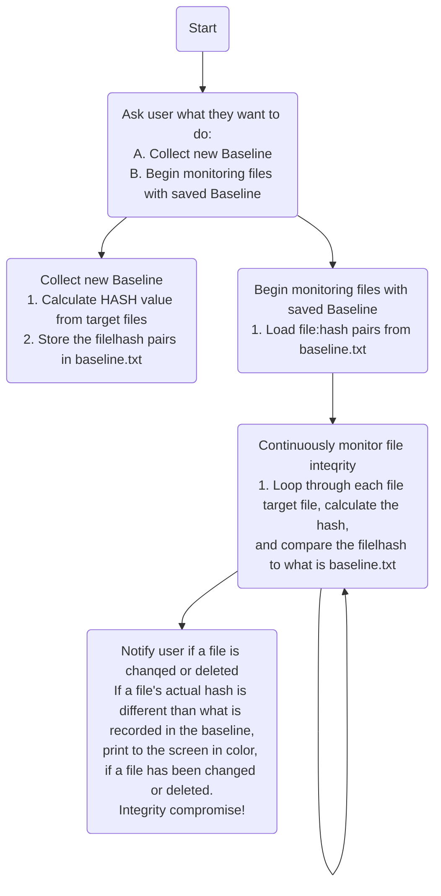

# File-Integrity-Monitor
FIM code based on Integrity from CIA Triad.

Integrity:
Integrity means that data can be trusted. It should be maintained in a correct state, kept so that it may not be tampered with, and should be correct, authentic, and reliable.
Integrity involves maintaining the consistency, accuracy and trustworthiness of data over its entire lifecycle. Data must not be changed in transit, and steps must be taken to ensure data cannot be altered by unauthorized people .

This code basically check if the given files get altered, changed or modified. it will alert user if made any changes in the file or hash.

Here is a simple flow chart:

